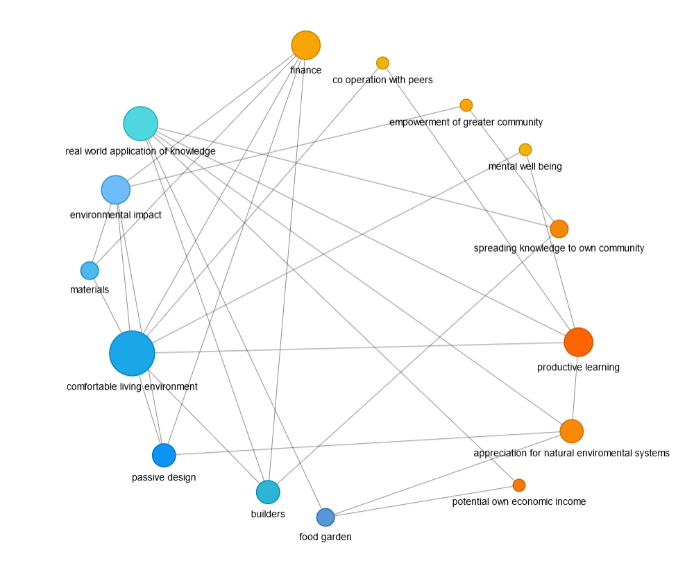

# Pyvis Network Graph Builder



This script builds a network graph using the Pyvis library in Python. It reads in a CSV file containing the edges of the graph, and generates an HTML file with the network graph visualization.

I plan to turn this into a webapp eventually but for the moment this gets the job done

## Requirements

To run this script, you need to have the following installed:

- Python 3
- Pyvis library

You can install Pyvis by running the following command:

```bash
pip install pyvis
```

## Usage

1. Clone or download the code from this repository.
2. Place your CSV file containing the edges in the same directory as the script.
3. Run the script using the following command:

```bash
python network_graph_builder.py
```

4. Follow the prompts to enter the filename of the CSV file and whether the graph is directed or undirected.
5. The script will generate an HTML file with the network graph visualization in the same directory as the script.

## CSV File Format

The CSV file should contain two columns with the following headers:

```
Source,Target
```

Each row represents an edge in the graph. The values in the "Source" and "Target" columns should be unique identifiers for the nodes.

NB: You should prefix each node with an integer that decides which category the node will fit into.

Optionally, you can include a third column with the following header:

```
Width
```

This column specifies the width of the edge. If not included, the default width of 0.1 will be used.

## Example CSV File

Here is an example CSV file for a network graph with four nodes and five edges:

```
Source,Target,Width
1A,1B,0.2
1B,2C,0.3
2C,3D,0.1
1A,3D,0.5
1B,3D,0.3
```

In this example, the edges from A to B and from B to D have custom widths, while the other edges use the default width.

## Credits

This script was written by Richard Taylor. 

## License

This code is licensed under the MIT License.
